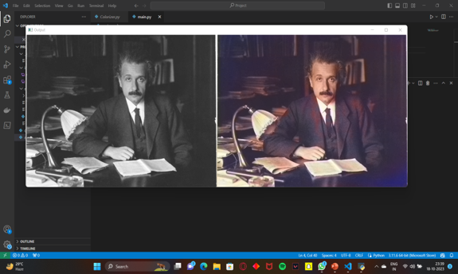
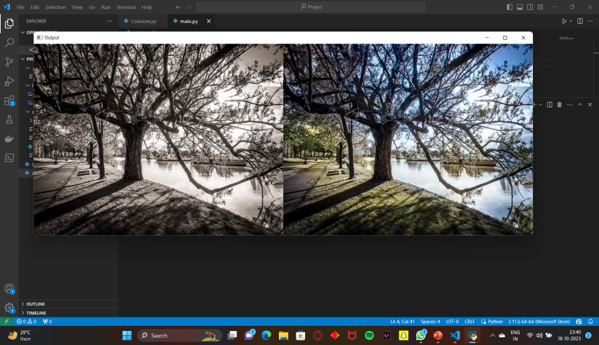

# 🎨 AI Colorization: Bringing Black and White to Life

## 🖌 Overview
AI Colorization is a powerful tool designed to **transform black and white images into vibrant, full-color masterpieces** using advanced artificial intelligence. Whether you're restoring historical photographs or enhancing personal memories, this tool brings them to life with stunning color accuracy.

## 🚀 Features
- **🔬 State-of-the-Art AI** – Uses deep learning models for **realistic and precise colorization** .
- **🖥️ User-Friendly Interface** – Simple upload mechanism for seamless image processing.
- **📷 High-Quality Output** – Produces **sharp, vivid images** while maintaining original details.
- **⚡ Fast and Efficient** – Provides quick results without compromising quality.

## 📸 Preview the Transformation

Before ➡️ After  
 

## 📌 Technologies Used
- **Python**
- **TensorFlow / PyTorch** (for AI model)
- **Flask / Streamlit** (for web interface)
- **OpenCV & NumPy** (for image processing)

## 🤝 Contributing
Contributions are welcome! Feel free to submit a pull request or report any issues.

_Developed with ❤️ by Aditya Kokate_

